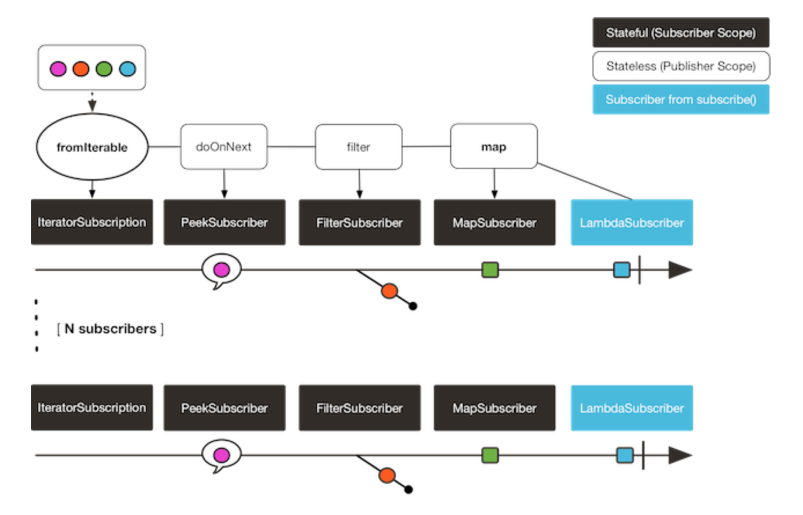
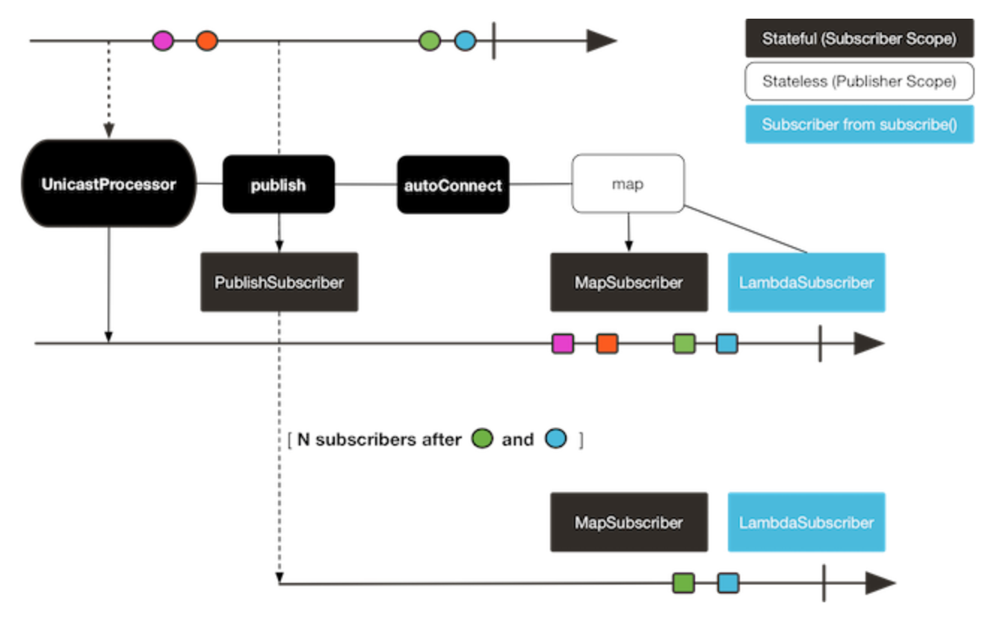

- 참고 자료 <a href="https://tech.kakao.com/2018/05/29/reactor-programming/" >링크</a>

- **Cold**

> Cold는 각 Flux나 Mono를 subsribe 할 때마다 매번 독립적으로 새로 데이터를 생성해서 동작합니다. 
즉, subsribe 호출 전까지 아무런 동작도 하지 않고, subsribe를 호출하면 새로운 데이터를 생성합니다. 



---
- **Hot**

> 그러나 Hot은 구독하기 전부터 데이터의 스트림이 동작할 수 있습니다. 
예를 들어서 마우스 클릭이나 키보드 입력 가 은 이벤트 성은 구독 여부와 상관없이 발생하고 있다가 
이 이벤트를 구독하는 여러 구독자가 붙으면 해당 이벤트가 발생할 때 모두 동일한 값을 전달 받을 수 있습니다. 
즉, Hot에 해당하는 스트림을 여러곳에서 구독하면 현재 스트림에서 나오는 값을 구독하는 구독자들은 동일하게 
받을 수 있습니다. 



--- 

- Cold를 Hot으로 전환할 수 있는 방법 

> Connectable Flux <br>
> publish 라는 메소드를 호출하면 Cold에서 Hot 으로의 변경이 가능합니다. <br> 
> 이렇게 변환된 Flux에서 connect()를 호출할 수 있는데, 이 메서드가 여러 구독자들이 Connetable Flux를 구독한 후 값을 생성하여 각 구독자에게 보내기 시작하게 하는 메서드입니다. 

---
```
sampleFlux.concatMap(items -> {
     final Flux<String> source = Flux.fromIterable(items).log().publish().autoConnect(2);
     final Mono<List<String>> distinctItems = source.distinct().collectList();
     final Mono<Map<String, Long>> countItemsMono = source
             .groupBy(item -> item) 
             .concatMap(groupedFlux -> groupedFlux.count()
                     .map(count -> {
                         final Map<String, Long> itemCount = new LinkedHashMap<>();
                         itemCount.put(groupedFlux.key(), count);
                         return itemCount;
                     }) 
             ) // concatMap으로 순서보장
             .reduce((accumulatedMap, currentMap) -> new LinkedHashMap<String, Long>() { {
                 putAll(accumulatedMap);
                 putAll(currentMap);
             }}); // 그동안 누적된 accumulatedMap에 현재 넘어오는 currentMap을 합쳐서 새로운 Map을 만든다. // map끼리 putAll하여 하나의 Map으로 만든다.
     return Flux.zip(distinctItems, countItemsMono, (distinct, count) -> new ItemInfo(distinct, count));
 }).subscribe(
     System.out::println,  // 값이 넘어올 때 호출 됨, onNext(T)
     error -> {
         System.err.println(error);
     }, // 에러 발생시 출력하고 countDown, onError(Throwable)
     () -> {
         System.out.println("complete");
     } // 정상적 종료시 countDown, onComplete()
 );
 ```
